## QuickCar
QuickCar is a vehicle rental project. It is developed with the laravel 9 framework. It is a platform where the admin can publish and edit a list of cars. Users can then reserve their car for specific dates. 

The application is currently hosted on heroku and accessible via this [link](https://voiture-express.herokuapp.com) : https://voiture-express.herokuapp.com 

## Some Interfaces
 
#### Home page
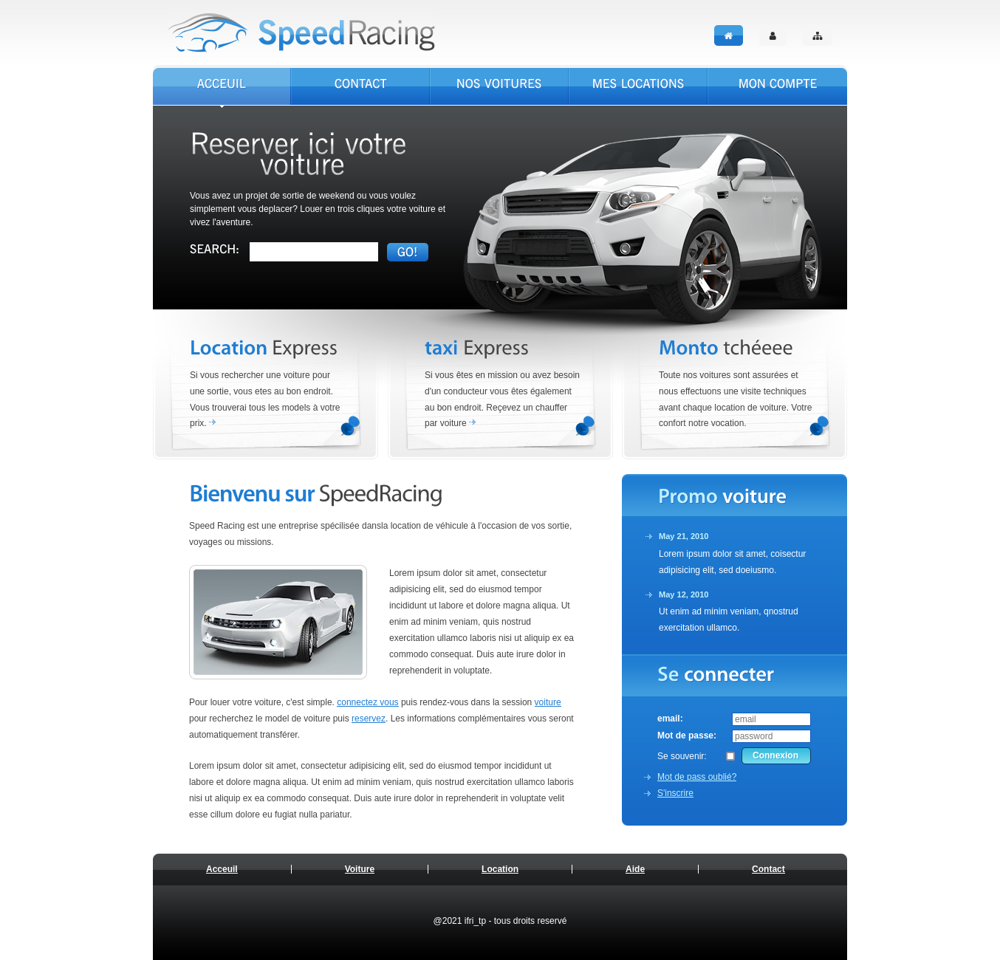
#### Contact page
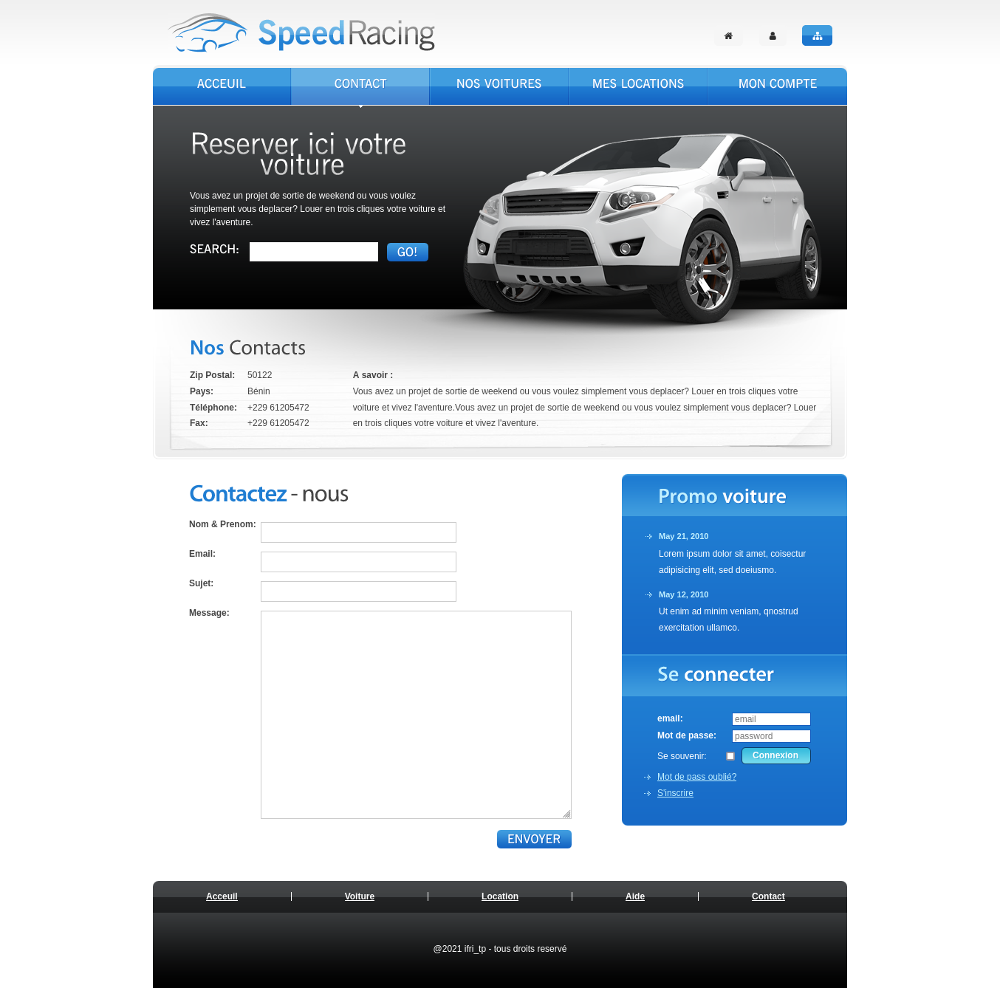
#### Login page
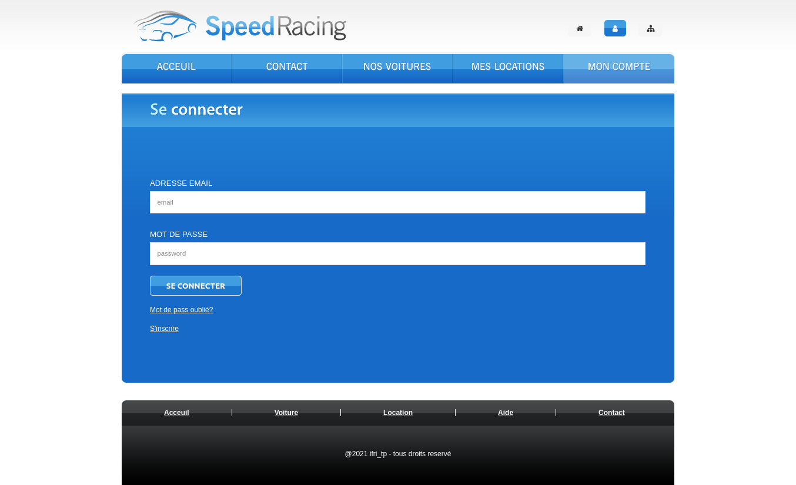
#### Register page
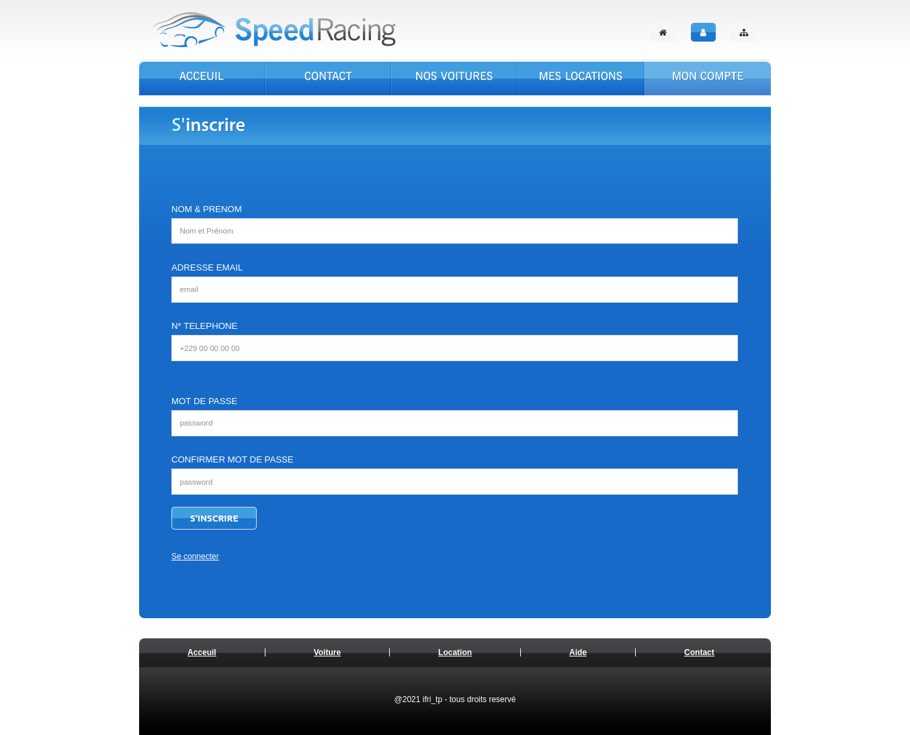
 
## Admin pages
 
#### Admin add car
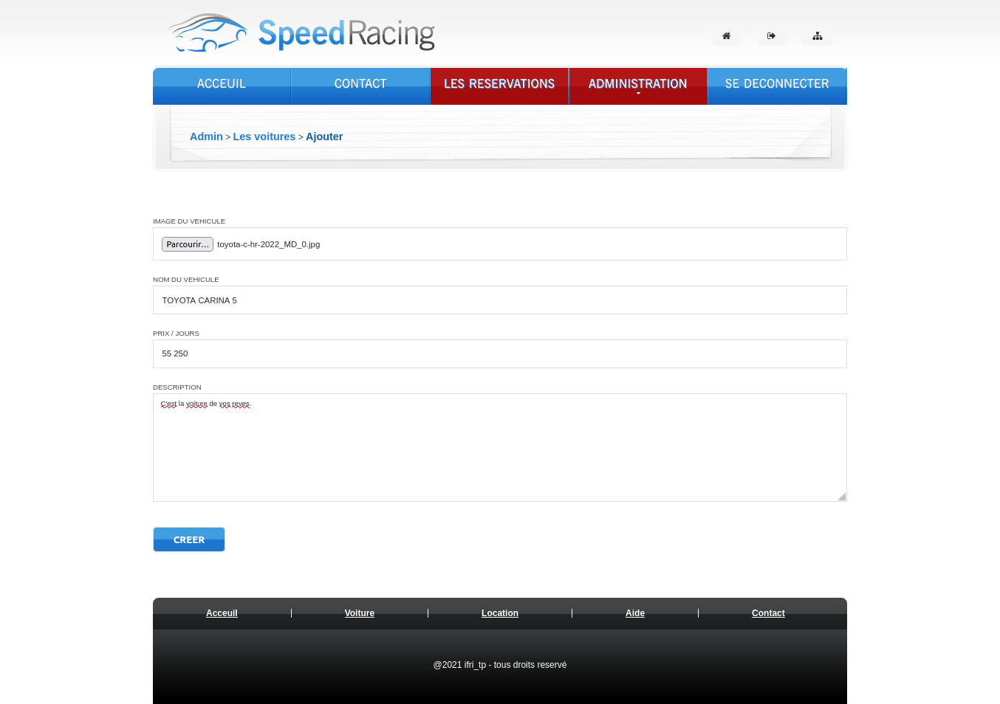
#### Admin publish, delete, update car data
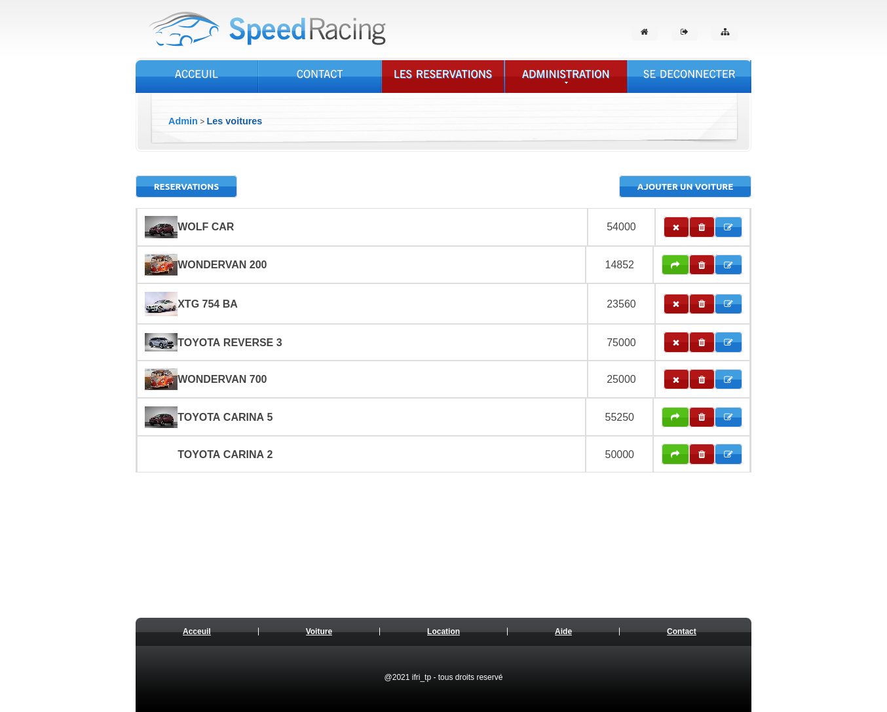
#### Admin car update form
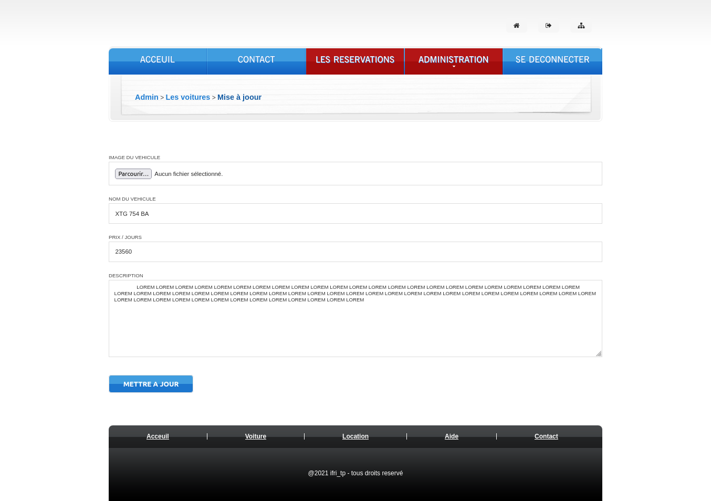
#### Admin all reeservation list 
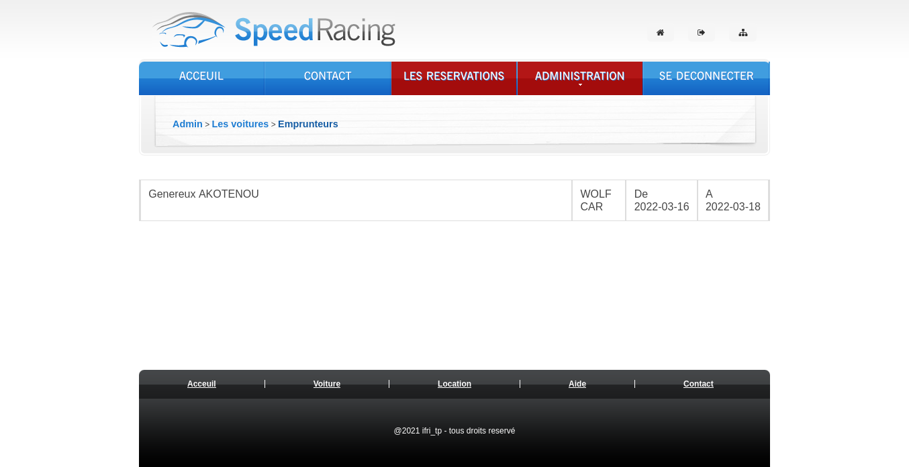
 
## User pages
 
#### All car view

#### Car details

#### check if car available forgiven date
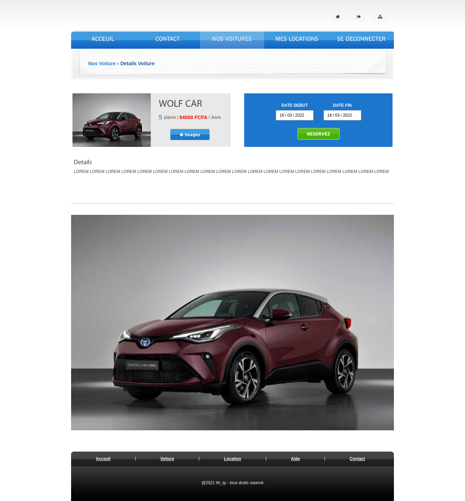
#### If car not available, we propose other car available in date range
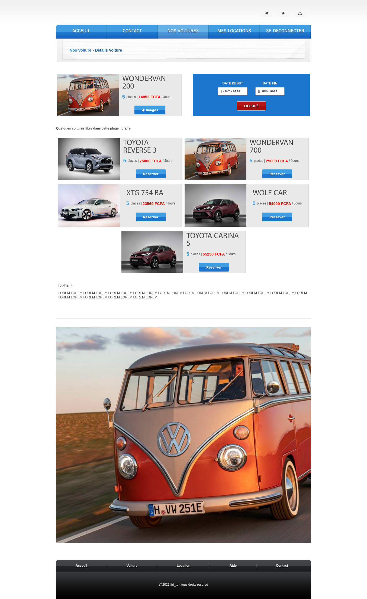
#### Make reservation
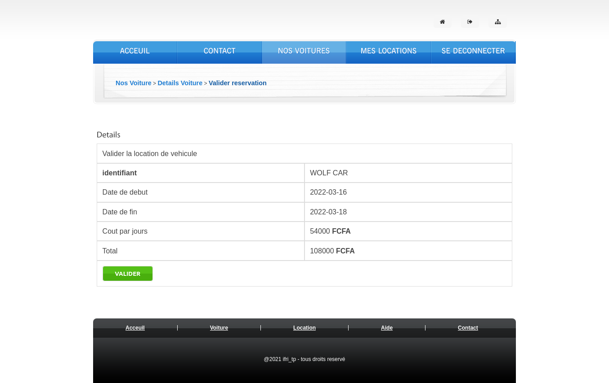
#### User reservation list
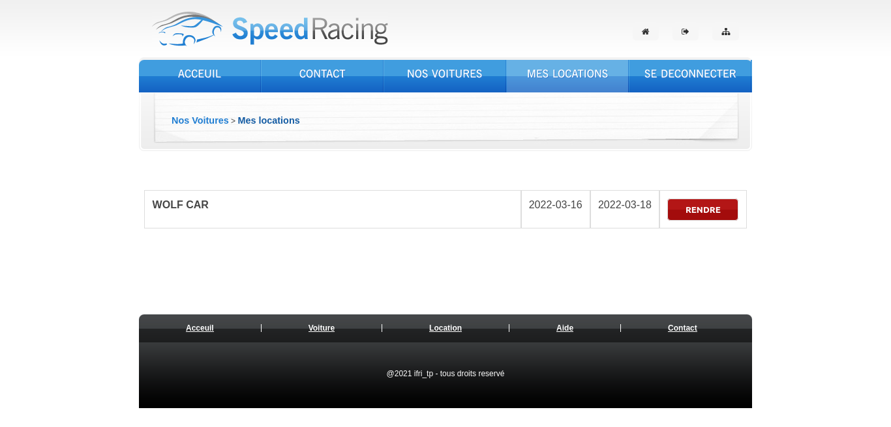

