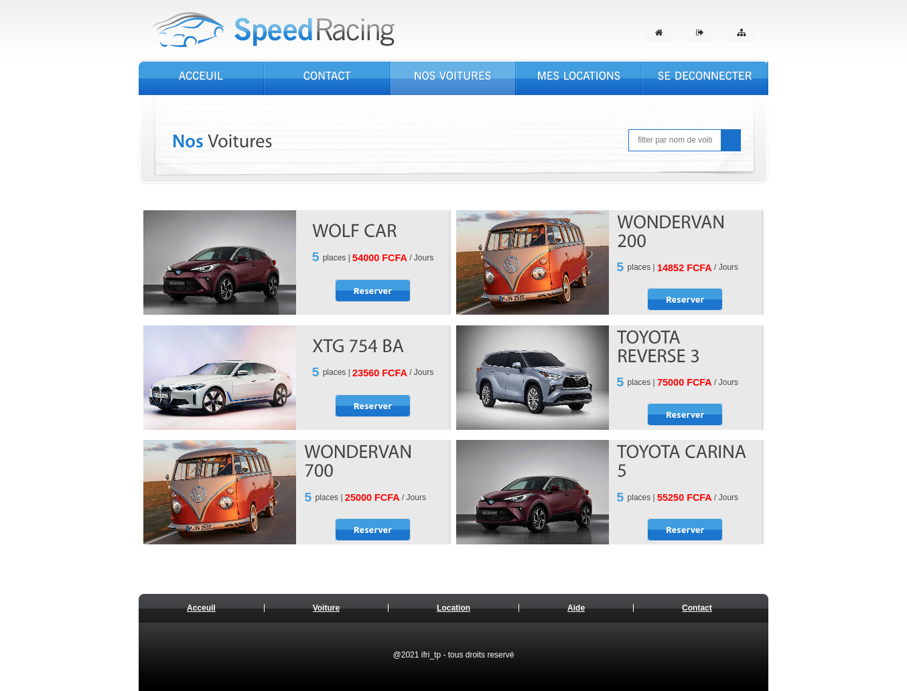

## QuickCar
QuickCar is a vehicle rental project. It is developed with the laravel 9 framework. It is a platform where the admin can publish and edit a list of cars. Users can then reserve their car for specific dates. 

The application is currently hosted on heroku and accessible via this [link](https://voiture-express.herokuapp.com) : https://voiture-express.herokuapp.com 

## Some Interfaces
 
<h3>Home page</h3>

<h3>Contact page</h3>

<h3>Login page</h3>

<h3>Register page</h3>

 
    
## Admin pages
 
<h3>Admin add car</h3>

<h3>Admin publish, delete, update car data</h3>

<h3>Admin car update form</h3>

<h3>Admin all reeservation list </h3>

 
    
## User pages
 
<h3>All car view</h3>

<h3>Car details</h3>

<h3>check if car available forgiven date</h3>

<h3>If car not available, we propose other car available in date range</h3>

<h3>Make reservation</h3>

<h3>User reservation list</h3>

